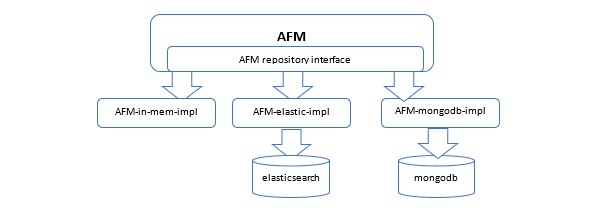
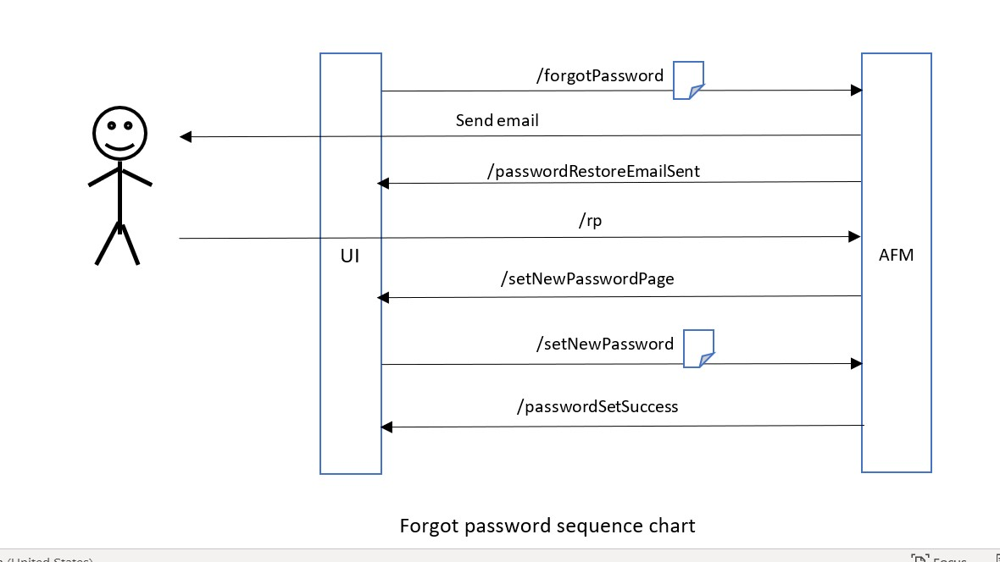

#  authentication-flows-js

### authentication-flows-js is a powerful and highly customizable framework that covers all flows that any express-based authentication-server needs.

[authentication-flows](https://github.com/OhadR/authentication-flows) for javascript

## Read the article in CodeProject:

## motivation

Every secured web application should support these flows - unless it delegates the authentication to a third party
(such as oAuth2.0). Thus, we end up in the same code written again and again. 

The `authentication-flows-js` module implements all authentication flows: 

 * authentication
 * create account, 
 * forgot password, 
 * change password by user request, 
 * force change password if password is expired,
 * locks the accont after pre-configured login failures.
 
`authentication-flows-js` is a package that any express-based secured web applications can reuse, to get all the flows 
implemented, with a minimal set of configurations. 
This way developers can concentrate on developing the core of their app, instead of messing around with flows that are
definitely not the core of their business.
 

## configuration

### sample application

I have prepared a [sample application](https://github.com/OhadR/authentication-flows-js-app) that uses `authentication-flows-js` so it is a great place to start. Below there are 
the required configurations needed. 

### repository adapters

According to the design:

The client-app chooses which repository it works with, and passes the appropriate adapters:  

    const app = express();
    var authFlows = require('authentication-flows-js');
    const authFlowsES = require('authentication-flows-js-elasticsearch');
    const esRepo = new authFlowsES.AuthenticationAccountElasticsearchRepository();
    
    authFlows.config({
        user_app: app,
        authenticationAccountRepository: repo,
        redirectAfterLogin,
        sendActivationEmailUponActivation   [optional, see below]
    });

currently, the following repositories are supported:

* [in-memory](https://github.com/OhadR/authentication-flows-js-inmem)
* [elasticsearch](https://github.com/OhadR/authentication-flows-js-elasticsearch)
* [gae-datasource](https://github.com/OhadR/authentication-flows-js-gae-datastore)

### express server object

This module *reuses* that client-app' express server and adds several endpoints to it (e.g. `/createAccount`).
Thus, the client-app should pass authentication-flows-js its server object (example above).

### password policy

authentication-flows-js comes with a default set of configuration for the password policy (in 
`/config/authentication-policy-repository-config.json`). The hosting application can replace\edit the JSON file, and use 
its own preferred values. 

The password policy contains the following properties (with the following default values):

    passwordMinLength: 6,
    passwordMaxLength: 10,
    passwordMinUpCaseChars: 1,
    passwordMinLoCaseChars: 1,
    passwordMinNumbericDigits: 1,
    passwordMinSpecialSymbols: 1,
    passwordBlackList: ["password", "123456"],
    maxPasswordEntryAttempts: 5,
    passwordLifeInDays: 60

an example for a client-app can be found [here](https://github.com/OhadR/authentication-flows-js-app).

## `body-parser`

According to https://www.digitalocean.com/community/tutorials/use-expressjs-to-get-url-and-post-parameters, the client-app
MUST use body-parser in order to be able to parse the body params.
Thus, the `authentication-flows-js` can use:

        debug(`createAccount requestBody ${req.body}`);

## dependencies

* `express` - this module uses web-api for flows such create-account, forget-password, etc.
* `@log4js-node/log4js-api` - rather than being dependent on a specific version of`log4js` (to avoid headache for this library users). 
* `nodemailer` - sending verification emails. version 4.7.0 and NOT latest: https://stackoverflow.com/questions/54385031/nodemailer-fails-with-connection-refused-using-known-good-smtp-server/54537119#54537119

## required environment variables (for hosting-app and tests)

    DEBUG=*,-follow-redirects -express:* -body-parser:*
    emailSender
    smtpServer
    smtpPort
    emailServerUser
    emailServerPass

## run tests

    ts-node test\mail\mail.test.ts

note: set the environment variables.

## deploy 

    npm run build
    npm version patch
    npm publish

## emails

This module sends verification emails. By default, it uses `nodemailer` and [SMTP2GO](https://www.smtp2go.com/),
but it makes sense that each application has its own mailing system. In addition, verification emails
may have the same look and feel of the hosting application. Hosing-application can have their own implementation by implementing `MailSender` interface.

## Flows

### Create Account

### Forgot Password

### Change Password

## API
   
The AFM supports the below APIs:

This URL renders the login page that is sent to the user:

    GET
    /login

As mentioned earlier, the AFM manages also the authentication of the hosting application:
   
    POST
    /login
        username: string
        password: string
   
By calling the URL, the hosting application can get the password policy. e.g. constraints like length, number of Capital 
letters required, number of digits required etc. This way the UI can alert the user if the password he chooses does not meet 
the requirements, before the request is sent to the server.

    GET
    /getPasswordConstraints

renders the create account page that is sent to the user:
   
    GET 
    /createAccount
   
    POST 
    /createAccount
    
    GET
    /aa
    
    GET 
    /forgotPassword
    
    POST 
    /forgotPassword
    
    GET 
    /rp
    
    POST 
    /setNewPassword
    
    POST 
    /deleteAccount

    GET
    /user                       get all users

    PUT
    /user/:email/authorities    set authorities for user

## tests

all flows are tested very clearly using [Cucumber automated tests](https://github.com/OhadR/authentication-flows-js-automation).

## refs

https://softwareengineering.stackexchange.com/questions/424981/authentication-flows-for-secured-applications

https://www.smashingmagazine.com/2020/03/creating-secure-password-flows-nodejs-mysql/

https://en.wikipedia.org/wiki/Cryptographically_secure_pseudorandom_number_generator

## Questions? issues? something is missing?

Feel free to open issues here if you have any unclear matter or any other question.

## versions

### 1.11.0

* store the last login date #21

### 1.10.0

* add APIs for management - `getAllUsers`, and `setAuthorities`. so hosting app can manage authorization for users. #17

### 1.9.0

* enable customized CreateAccountInterceptor #18

### 1.8.0

* debug message: use prefix, so hosting app can omit the auth-flows logs using asterik (like ' -body-parser:*') #16
* handle authorization: store authorities on the session (#17 related)

### 1.7.0

* bugfix #17: rollback 1.4.0 'avoid sending activation email upon account-creation #11'

### 1.6.1 (1.6.0 is bad)

* the subject of the email - allow it to contain the hosting-application's name #14

### 1.5.0

* bugfix: after failed-authentication, redirect properly back to login page. currently there is "Unauthorized. Redirecting to /login" #12

### 1.4.0

* avoid sending activation email upon account-creation #11 (see above)

### 1.3.0

* redirect after login: till now, after login there was a redirect-back; but technically it led me back to login page, 
  and this is not the desired behavior. So now I redirect to '/', and also the client app have the option to override this 
  and to redirect to a different page, via the config option `redirectAfterLogin`.

### 1.2.0

* bugfix | change password flow: get the token from the url correctly.

### 1.1.0

* use GitHub-CI rather than Travis-CI.
* re-arrange (dev-)dependencies in package.json
* add build scripts (with rimraf).

